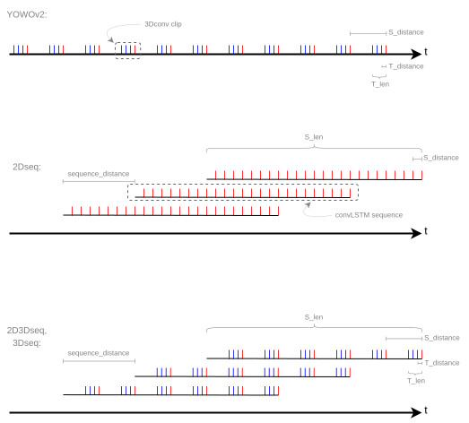
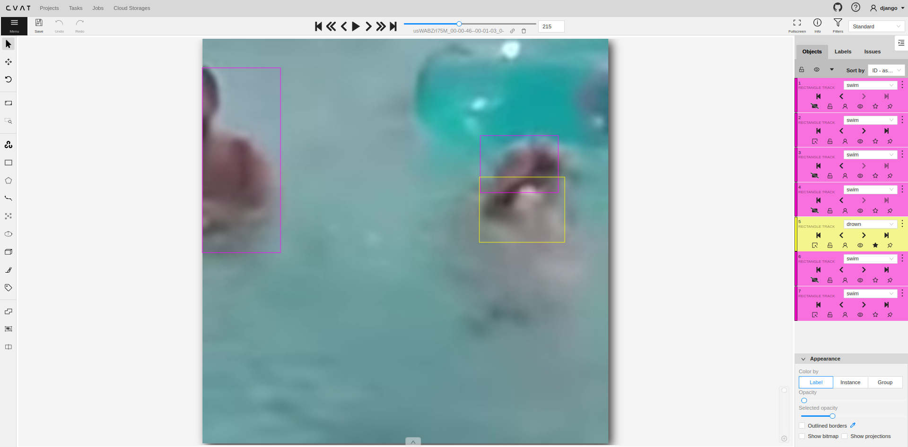
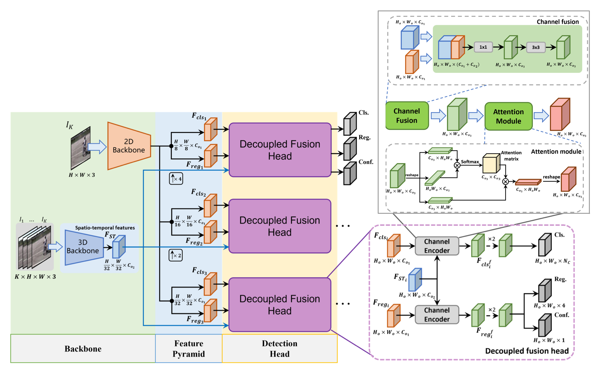
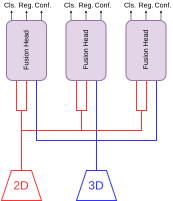
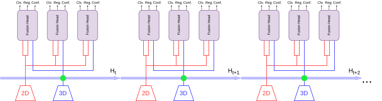
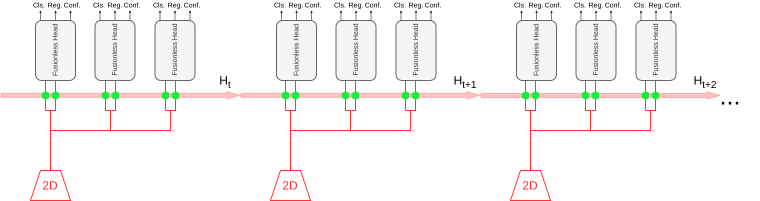
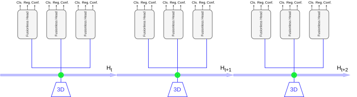
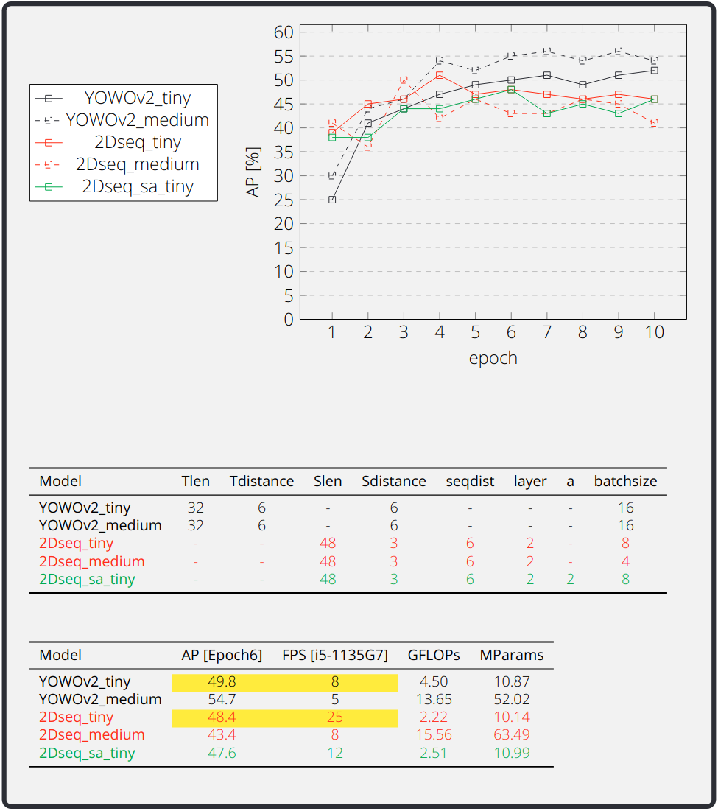
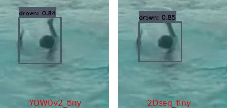
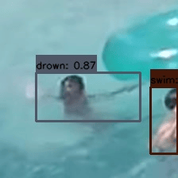

# Drowning Detection via Real-Time Spatio-Temporal Action Localization

2024-09-16 by David Nicklaser  

This project detects early drowning via real-time spatio-temporal action localization. Most current solution in the market detect if a person has stopped moving at the bottom of the pool while this solution detects drowning in the early stages while the person is still above the water.

The main contributions are threefold. First about detecting drowning: it is not as difficult as one might expect. Splashing of water is less a problem than the intuitive skepticism suggests. Instead, the harder parts are distinguishing 'descending and ascending' motions from drowning, and separating 'crawling' from drowning. Second, there are no existing spatio-temporal datasets for drowning detection. I solved that problem by creating one and making it public here. Third, the project shows that YOLO can be extended with a convolutional LSTM to make it recurrent. An approach hard to find in the literature. This enables very fast inference for spatio-temporal action localization as demonstrated in experiments.

## Installation

Clone the project and move into the directory:
```bash
git clone https://github.com/Z5cc/drowning-detection.git  
cd drowning-detection
```

Only *Python 3.8* has been tested. Other versions might work as well. You can check your version with:
```bash
python3 --version 
```

Create a virtual environment, activate it and install the requirements:
```bash
python3 -m venv .venv && source .venv/bin/activate
pip install -r requirements.txt
```

For all three scripts *train.py*, *test.py*, and *eval.py* the --config option should be set to the desired configuration file. If it is not provided, *default_config* will be used as the configuration file. The selected configuration file determines which model architecture is loaded. The different models are described in the Architecture chapter. In addition to the model choice, the configuration file also defines other settings used by the program. The available configuration files and their location are explained at the end of this Installation chapter. Before running the scripts, the dataset has to be installed first. See chapter Dataset.

Run the *train.py* file for learning:
```bash
python3 train.py --config YOWOv2_medium
```

Run the *test.py* file for inference:
```bash
python3 test.py --config YOWOv2_medium
```

Run the *eval.py* file for evaluation:
```bash
python3 eval.py --config YOWOv2_medium
```

In the following the configuration files are explained. These files are located in the *config* folder. Every file in this folder except the *yowo_v2_config.py* file represents a possible config to run the program with the --config option as explained before. For example the *2Dseq_medium.py* configuration file contains the configuration for the 2Dseq architecture with architecture size medium. Having a separate file for each configuration makes it easy to try out different setups while still keeping track of older ones.

The following paragraphs describe the specific entries found in such configuration files. The first six entries define the basic settings of the chosen architecture. The actual architecture is selected through the *mode* entry.

The entries seven to eleven, *T_len*, *T_distance*, *S_len*, *S_distance* and *sequence_distance* set the distances between selected frames. The prefix *T* refers to the 3D convolution. The prefix *S* refers to the convolutional LSTM within one sequence. Wherever the *sequence_distance* represents the amount of frames between different such sequences. These entries are visualized in the next graph. Reading the Architecture chapter first will help in understanding them.

Entry twelve *layers* is the amount of layer for the convolutional LSTM.

Entries thirteen to fifteen *fold*, *version* and *epoch_weight* set the dataset and weight selection. *fold* chooses the fold used in cross-validation. *version* and *epoch_weight* are used to compose the name of the weight file for the *test.py* and *eval.py* scripts.

The entries sixteen and seventeen *eval* and *eval_first* control the evaluation settings during training.




## Dataset

For creating the dataset 82 youtube videos, mostly from the youtube channel 'Lifeguard Rescue', were used. From these 82 videos, 111 video snippets with a resolution of 224×224 pixels were extracted. Each snippet is around 25 seconds long and includes about three individuals who are either swimming or drowning. For labeling, a rectangular bounding box is drawn around each individual by hand on every 6th frame of the 30 FPS snippets using CVAT. Each bounding box is assigned either a swim or drown label. For the frames in between, the labels are automatically interpolated by CVAT. The next image shows a screenshot taken during the labeling process in CVAT.

Since no suitable dataset existed and I had to label everything by hand, I am aware that the dataset itself is probably the most valuable part of this project. For that reason, I set it up so that it can be recreated with a script. The dataset is located in the *dataset_lifeguard* folder. The *labels* subfolder contains the labels, which are already included in this repository. The *videos* and *frames* subfolders contain the snippets and need to be reconstructed using the *dataset_utils/LifeguardUtils.py* script. 
```bash
python3 dataset_utils/LifeguardUtils.py
```
This script reconstructs the dataset. It downloads the youtube videos into the *videos_source* subfolder. If there are problems with downloading the videos automatically, contact me on Github and I can provide them. After downloading, the script creates the *videos* and *frames* subfolders based on the file *dataset_lifeguard/datalist.csv*. The *videos* subfolder is for anyone who wants to relabel the data in CVAT, while the *frames* folder is used for training and inference.




## Architecture

YOWOv2 is chosen as the base architecture. For a detailed explanation of the YOWOv2 implementation, see the official github repository https://github.com/yjh0410/YOWOv2 and its paper. A brief description is provided in the following. YOWOv2 uses a YOLO-based architecture. For that, YOLO is split into two parts, the 2D backbone and the detection head. The first part of this split, the 2D backbone, is used to extract spatial features from the most recent frame. Simultaneously, 3D convolution is applied to the 32 most recent frames to capture temporal features, which is the 3D backbone. A decoupled fusion head then merges the features from both the 2D and 3D backbones separately for bounding box regression and classification in the detection head. As a reminder, the detection head is the second part of the YOLO-split. The following graphic is taken from the YOWOv2 paper. It is not created by me. I put it here to allow easier understanding of YOWOv2.

<br>
Source: https://github.com/yjh0410/YOWOv2

There was motivation to improve this base architecture for the following reason. Experiments with the original YOWOv2 setup showed two main difficulties in detecting drowning. One challenge is distinguishing 'descending and ascending' from drowning, and the other is distinguishing 'crawling' from drowning. Adding a convolutional LSTM layer helps to keep long-term information and could therefore address these issues. The first image below is an abstraction of the YOWOv2 architecture. The other three images show the 2D3Dseq, 2Dseq, and 3Dseq architectures, where the convolutional LSTM has been added at the position marked by the green dot.

<br>Architecture version: YOWOv2

<br>Architecture version: 2D3Dseq

<br>Architecture verion: 2Dseq

<br>Architecture version: 3Dseq


## Evaluation

After evaluating and comparing all models that include a convolutional LSTM, it became clear that 2Dseq outperforms both 2D3Dseq and 3Dseq. For that reason, only 2Dseq is compared against YOWOv2. The results of the final evaluation are shown in the following diagram. 2Dseq is able to address the issues related to 'descending and ascending' vs. drowning' and 'crawling' vs. drowning, which can be seen in the comparison images below. In addition, it runs much faster (3x) than YOWOv2 for the tiny model size. These FPS are marked yellow in the following.

<br>




## Demo

In addition to the final comparison between YOWOv2_tiny and 2Dseq_tiny shown above, the inference results of fold 1, fold 3 and fold 8 from the cross-evaluation of the original YOWOv2 architecture of size medium are also demonstrated. These results come from epoch 6.

<br>

<br>


## Credits

**This project includes code licensed as follows:**

https://github.com/yjh0410/YOWOv2  
Original code: Copyright (c) 2023 Jianhua Yang and Dai Kun, released under the MIT License.

https://github.com/ndrplz/ConvLSTM_pytorch  
Original code: Copyright (c) 2017 Andrea Palazzi, released under the MIT License.

**If you use my project and this code in any form, please cite the following:**  

```bibtex
@misc{nicklaser2024drowning,
    title={Drowning Detection via Real-Time Spatio-Temporal Action Localization},
    author={Nicklaser, David},
    year={2024},
    url={https://github.com/Z5cc/drowning-detection}
}
```